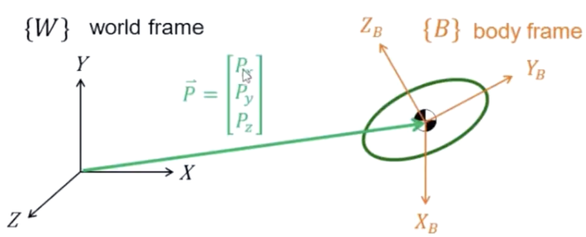
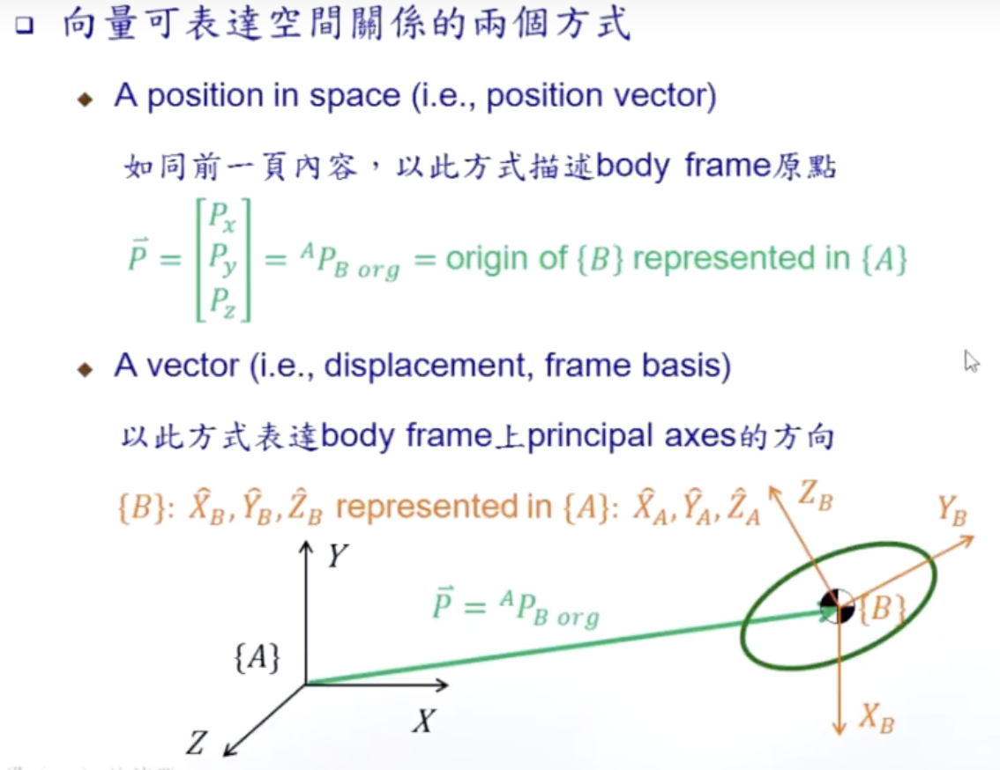
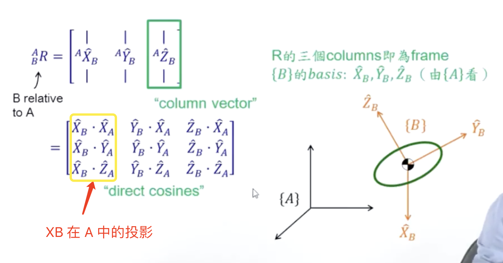
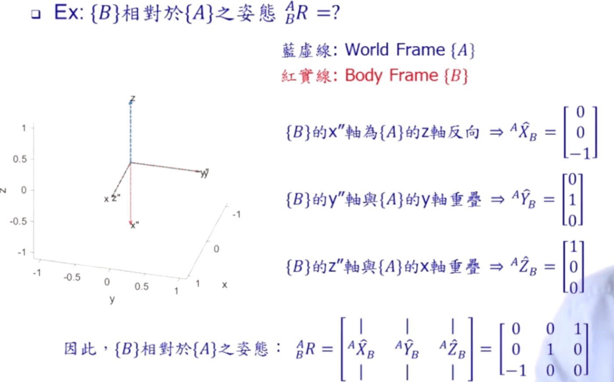
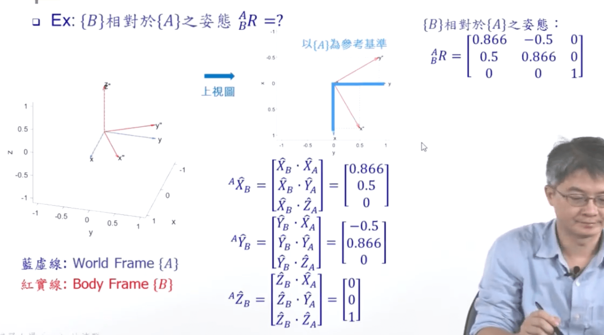
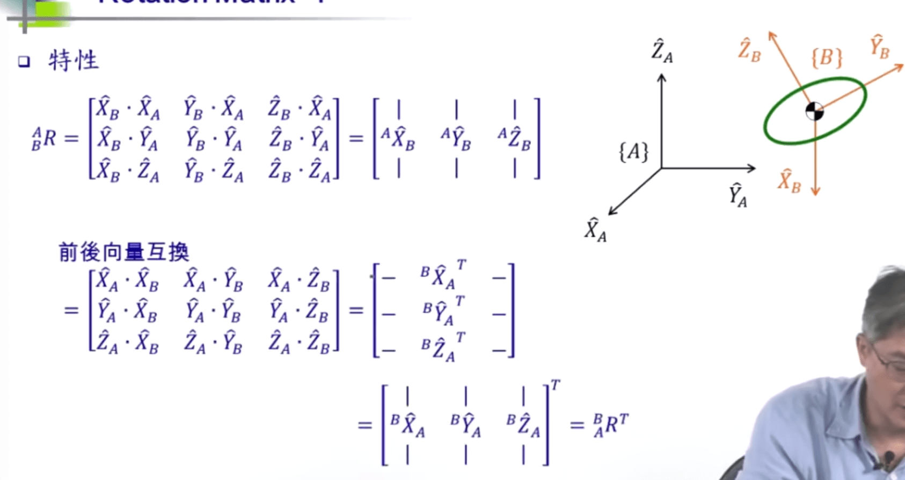

# 移动 rotation matrix

以向量vector 来标书{B}的原点相对于{A}的状态

<figure><figcaption></figcaption></figure>

<figure><figcaption></figcaption></figure>

## rotation matrix 旋转矩阵

<figure><figcaption></figcaption></figure>

<figure><figcaption></figcaption></figure>

练习 1

<figure><figcaption></figcaption></figure>

### 特性

B 在 A 的 R 进行 transpose 后值不变，变为 A 在 B 的 R

(AB)R，中的 X，是 XB 在 A 的 XYZ 三个分量的值

(BA)RT，中是 X 是，XA 在 B 的 XYZ 三个分量的值

<figure><figcaption></figcaption></figure>

练习

